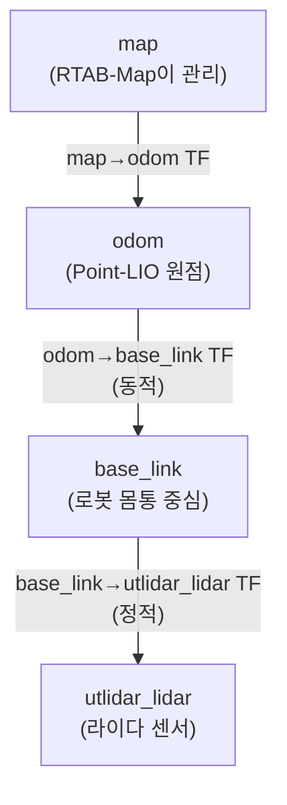

# SLAM 맵핑 데이터의 이해: Frame과 Deskew를 분리해서 보기

## 맨 앞 요약

가장 쉬운 설명은 이것입니다.

> `cloud_deskewed`는 이미 **odom pose가 적용된 완제품**이다.  
> 그래서 RTAB-Map이 이것을 다시 `base_link` 기준 local cloud처럼 쓰려면 역변환이 필요한데,  
> 그때 꼭 필요한 **"이 점군을 만들 때 실제로 사용한 정확한 pose/trajectory"**를 외부에서는 그대로 알 수 없다.  
> 결국 `header.stamp` 근처의 odom/TF로 **근사해서** 되돌릴 수밖에 없고, 그 시각 차이가 벽 번짐 같은 잔오차로 나타난다.

쉽게 말하면:

- **여러 시점의 포인트들을 내부 trajectory로 보정해 만든 `odom` 기준 완제품을, 외부에서 단일 시각 odom/TF로 근사 역변환하려 하니까 문제가 생긴다.**

즉 현재 문제의 핵심은 다음 한 문장으로 요약할 수 있습니다.

- **문제는 `deskewed` 자체가 아니라, `odom` 기준으로 이미 완성된 point cloud를 나중에 다시 local cloud처럼 되돌려 써야 한다는 점이다.**

---

Unitree Go2와 RTAB-Map 조합에서 헷갈리기 쉬운 개념은 `deskewed`와 `base_link`가 같은 종류의 속성이 아니라는 점입니다.

- `deskewed`는 **스캔 왜곡을 보정했는가**
- `base_link` / `utlidar_lidar` / `odom`은 **어느 좌표계(frame)로 표현했는가**

즉 "deskewed냐 아니냐"와 "base 기준이냐 odom 기준이냐"는 서로 다른 축입니다.

---

## 1. 점군은 두 가지 축으로 구분해야 한다

### A. Frame 축: 로컬 vs 글로벌

- **로컬 점군 (Local Point Cloud)**  
  기준점이 `utlidar_lidar` 또는 `base_link`인 점군입니다. 로봇이 움직여도 점은 항상 센서 또는 로봇 몸통 기준으로 표현됩니다.
- **글로벌 점군 (Global Point Cloud)**  
  기준점이 `odom` 또는 `map`인 점군입니다. 로봇 위치가 이미 좌표에 반영되어 절대 좌표로 펼쳐진 상태입니다.

### B. 보정 축: Raw vs Deskewed

- **Raw Point Cloud**  
  스캔 중 로봇이 움직이며 생긴 왜곡이 남아 있는 점군입니다.
- **Deskewed Point Cloud**  
  스캔 왜곡을 제거한 점군입니다.

### C. 실제로는 이 조합이 섞여 나온다

| 종류 | 의미 | 비고 |
|------|------|------|
| Local Raw | 로컬 frame + 왜곡 남음 | 보통 센서에서 바로 나온 원본 |
| Local Deskewed | 로컬 frame + 왜곡 제거 | RTAB-Map이 가장 선호하는 입력 |
| Global Deskewed | `odom`/`map` frame + 왜곡 제거 + 로봇 pose 반영 완료 | 지금 문제가 되는 형태 |

중요한 점:

- **`base_link` 기준 cloud는 여전히 로컬 점군**입니다.
- **`deskewed`라고 해서 자동으로 `odom` 기준이 되는 것은 아닙니다.**
- 가장 좋은 형태는 보통 **`utlidar_lidar` 또는 `base_link` 기준의 local deskewed cloud**입니다.

---

## 2. RTAB-Map이 실제로 원하는 것

RTAB-Map의 핵심은 루프 클로저입니다. 이를 위해 RTAB-Map은 아래 두 가지를 **따로 저장**합니다.

1. **로봇의 위치 궤적 (Pose Graph)**
2. **각 위치에서 찍은 로컬 점군 (Local Point Cloud)**

이렇게 분리해 두면 나중에 지도가 틀어졌을 때, 점 하나하나를 다시 계산하지 않고 **pose graph만 수정한 뒤 로컬 점군을 새 위치에 다시 배치**할 수 있습니다.

그래서 RTAB-Map 관점에서 입력 점군은 다음 순위가 됩니다.

1. **가장 좋음:** Local Deskewed Cloud
2. **사용 가능:** Local Raw Cloud
3. **불편함:** Global Cloud (`odom`에 이미 펼쳐진 cloud)

즉 RTAB-Map이 싫어하는 것은 "deskewed"가 아니라 **"이미 `odom` 좌표가 박힌 global cloud"**입니다.

---

## 3. 우리 시스템을 이 기준으로 다시 보면

현재 문서와 코드의 해석 기준으로는:

- `/utlidar/cloud_deskewed`는 **deskew는 되어 있지만, frame은 `odom`인 global cloud**
- RTAB-Map은 `frame_id=base_link`, `odom_frame_id=odom`을 기준으로 동작

즉 현재 파이프라인은 아래와 같이 해석할 수 있습니다.

1. **(로봇 내부)** 로컬 스캔을 deskew
2. **(로봇 내부)** 그 스캔에 현재 odom pose를 적용해서 `odom` 기준 점군으로 변환
3. **(PC/RTAB-Map)** 그 global cloud를 다시 `base_link` 기준 로컬 스캔처럼 되돌려 사용
4. **(RTAB-Map)** 필요할 때 다시 pose graph 위에 배치

이 구조 때문에 global -> local -> global의 왕복이 생깁니다.

---

## 4. 현재 TF 구조와 이 문제의 직접 연결

현재 시스템의 TF 관계는 개념적으로 아래와 같습니다.

여기서 중요한 점은:

- `odom -> base_link`는 **시간에 따라 변하는 동적 pose**
- `base_link -> utlidar_lidar`는 **고정된 정적 TF**

따라서:

- 로컬 cloud를 직접 받으면 주로 정적 TF만 쓰면 되고
- `odom` 기준 global cloud를 local로 되돌리려면 **동적 TF의 정확한 시각**이 필요합니다

지금 오차는 바로 이 지점에서 생깁니다.

---

## 5. 중요한 오해 하나: "odom 오차가 두 번 먹는가?"

결론부터 말하면 **아닙니다.**

- RTAB-Map이 역변환할 때 **새로운 odom을 다시 추정하는 것**이 아닙니다.
- 이미 존재하는 `odom -> base_link` pose를 사용해서 좌표를 되돌리는 것입니다.

따라서:

- **수학적으로 같은 pose, 같은 시각**을 썼다면  
  `local -> odom -> local` 왕복은 거의 정확히 상쇄됩니다.
- 추가 오차는 **"odom drift가 두 번 누적"**되어서 생기는 것이 아니라,  
  **cloud를 만들 때 쓴 pose/time과 RTAB-Map이 되돌릴 때 쓴 pose/time이 완전히 같지 않아서** 생깁니다.

즉 문제의 본질은 "odom을 두 번 썼다"가 아니라 **"동일한 odom 체계를 서로 다른 시각으로 사용했다"**입니다.

---

## 6. 시간 오차는 어디서 생기나

역변환에서 중요한 시각은 최소 4개입니다.

- `t_make`: 로봇 내부가 `cloud_deskewed`를 만들 때 실제로 사용한 pose 시각
- `t_cloud`: `/utlidar/cloud_deskewed.header.stamp`
- `t_odom`: `/utlidar/robot_odom.header.stamp`
- `t_use`: RTAB-Map이 `odom -> base_link` TF lookup에 사용한 시각

이 값들이 사실상 동일하면 문제가 거의 없습니다.  
하지만 현실에서는 다음 이유로 서로 달라질 수 있습니다.

### A. cloud 생성 기준 시각과 header.stamp의 의미가 다를 수 있다

예를 들어 한 라이다 스캔이 `20.000s ~ 20.100s` 동안 모였다고 할 때:

- Point-LIO는 스캔 끝 시각 기준 pose로 deskew를 수행할 수 있고
- 메시지 `header.stamp`는 스캔 중앙 시각이나 다른 기준 시각으로 찍힐 수 있습니다.

그러면 cloud를 만들 때 쓴 pose 시각과, 나중에 RTAB-Map이 믿는 시각이 달라집니다.

### B. cloud와 odom이 서로 다른 스트림이어서 stamp가 정확히 일치하지 않을 수 있다

- `cloud_deskewed`는 cloud 발행 주기
- `robot_odom`은 odom 발행 주기

가 서로 다를 수 있습니다. stamp가 몇 ms만 어긋나도, 움직이는 로봇에서는 pose가 달라집니다.

### C. RTAB-Map은 근사 동기화와 TF 보간을 사용할 수 있다

정확히 같은 시각의 cloud/odom 쌍이 없으면, RTAB-Map은 **가까운 시각**의 메시지와 TF를 사용하게 됩니다. 이때 미세한 잔오차가 남습니다.

### D. 단순 WiFi 지연 자체가 본질은 아니다

네트워크 지연으로 메시지가 늦게 도착하는 것 자체는, **원래 timestamp가 잘 보존된다면** 바로 기하 오차를 만들지는 않습니다.

문제의 본질은:

- cloud를 만들 때 사용한 pose의 시각
- RTAB-Map이 inverse transform에 사용한 pose의 시각

이 서로 완전히 같지 않을 수 있다는 점입니다.

### E. 오차 크기 예시

- 로봇 속도 `1 m/s`
- 시각 차이 `10 ms`

이면 병진 오차만으로도 약 `1 cm`가 생깁니다.

회전 중이라면 더 커질 수 있습니다. 예를 들어 5m 앞 벽을 보고 있을 때 yaw rate가 크면, 작은 각도 차이만으로도 벽이 옆으로 수 cm 밀려 보일 수 있습니다.

이 현상이 누적되면 벽이 한 줄이 아니라 두꺼운 띠처럼 번져 보입니다.

---

## 7. 현재 코드에서 이 위험이 실제로 존재하는가

현재 저장소 기준으로는 **존재합니다.**

- `/utlidar/cloud_deskewed`를 받아 다시 발행하는 릴레이가 있음
- `/utlidar/robot_odom`으로부터 `odom -> base_link` TF를 발행함
- cloud와 odom을 **별도 callback**으로 처리함
- RTAB-Map은 cloud/odom을 **approximate sync**로 받음

즉 현재 파이프라인은 다음 네 시각이 완전히 같다고 보장하지 않습니다.

- cloud를 만들 때 실제로 사용한 pose 시각
- `cloud_deskewed.header.stamp`
- `robot_odom.header.stamp`
- RTAB-Map이 inverse transform에 실제 사용한 TF 시각

이 문서의 요점은 "우리 코드가 odom 오차를 새로 계산해서 더 만든다"는 뜻이 아닙니다.  
오히려 **이미 완성된 global cloud를 local처럼 다시 쓰는 과정에서 필요한 정확한 내부 pose 시각을 외부에서 그대로 복원할 수 없다는 점**이 핵심입니다.

---

## 8. 그렇다면 local cloud를 직접 받으면 뭐가 달라지나

만약 로봇에서 아래 둘 중 하나를 직접 받을 수 있다면 상황이 크게 좋아집니다.

1. **`utlidar_lidar` 기준 local cloud**
2. **`base_link` 기준 local cloud**

이 경우:

- `odom` global cloud를 다시 `base_link`로 되돌리는 **동적 역변환 단계가 사라집니다**
- `utlidar_lidar -> base_link`만 필요하다면 이는 **정적 TF**이므로, 지금 문제인 동적 pose 시각 mismatch가 사실상 사라집니다

다만 차이는 남습니다.

- **Local Raw Cloud**  
  역변환 오차는 사라지지만, 스캔 자체의 motion distortion은 남을 수 있습니다.
- **Local Deskewed Cloud**  
  역변환 오차도 없고, motion distortion도 줄어드는 가장 좋은 형태입니다.

---

## 9. 실전 결론

현재 문제를 정확히 표현하면 다음과 같습니다.

- 문제는 **"deskewed cloud라서"**가 아니다.
- 문제는 **"`odom` 기준으로 이미 globalized 된 deskewed cloud를 RTAB-Map이 다시 local로 되돌려 써야 한다"**는 점이다.
- 추가 오차는 **"odom이 두 번 계산되어서"**가 아니라,  
  **그 왕복에 사용된 pose/time이 완전히 일치하지 않아서** 생긴다.

---

## 10. 핵심 비교 표

| 구분 | Local Raw | Local Deskewed | Global Deskewed (`odom`) |
|------|-----------|----------------|--------------------------|
| Frame | `utlidar_lidar` / `base_link` | `utlidar_lidar` / `base_link` | `odom` |
| Motion distortion | 남을 수 있음 | 작음 | 작음 |
| RTAB-Map 입력 적합성 | 사용 가능 | 가장 좋음 | 가장 불리함 |
| Inverse transform 필요 | 없음 | 없음 | 있음 |
| 동적 TF 시각 mismatch 위험 | 낮음 | 낮음 | 높음 |

---

## 11. 해결책 우선순위

1. **가장 좋은 해결책:**  
   로봇에서 `utlidar_lidar` 또는 `base_link` 기준의 **local deskewed cloud**를 직접 받는다.
2. **차선책:**  
   local raw cloud라도 직접 받는다. 그러면 inverse transform에 따른 시간 오차는 사라지고, 남는 문제는 motion distortion 쪽으로 한정된다.
3. **현 구조 유지 시 개선:**  
   cloud와 odom의 시간 의미를 더 정밀하게 맞추고, 가능한 한 exact pairing에 가깝게 다룬다.
4. **용도 전환:**  
   루프 클로저보다 단순 누적이 중요하다면 Octomap 같은 방식으로 global cloud를 그대로 사용하는 것도 현실적인 선택이다.
